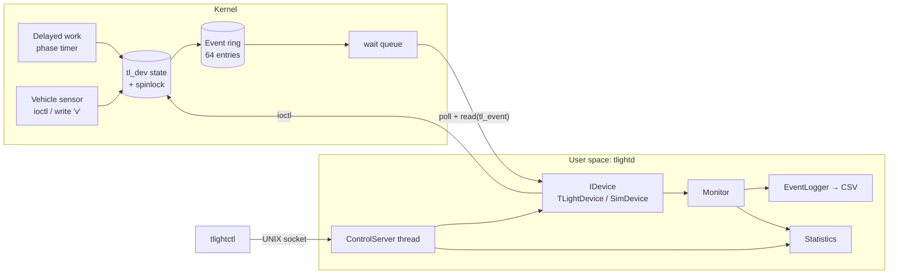

# Stage 3 – System Design & Architecture

## 1. Architecture

Layers: **hardware/kernel** (driver) → **device abstraction** (`IDevice`) → **services** (monitor, logger,
statistics, control server) → **client** (`tlightctl`).

## 2. Components and responsibilities

| Component | Responsibility |
|---|---|
| `tlight.c` | Own the light state, run the timer, detect violations, queue events, expose the file API |
| `tlight_uapi.h` | Single source of truth for structs/ioctl numbers shared with user space |
| `IDevice` | Abstract device operations; decouples services from kernel |
| `TLightDevice` | RAII wrapper for `/dev/tlight` (open/poll/read/ioctl/close) |
| `TrafficStateMachine` | Pure logic identical to the driver; used by simulator and tests |
| `SimDevice` | Thread-safe simulator implementing `IDevice` (real-time or manual clock) |
| `Monitor` | Poll loop: read events → statistics + log; error back-off |
| `EventLogger` | Thread-safe CSV writer (`ts,event,state,violations`) |
| `Statistics` | Mutex-protected counters, text summary |
| `ControlServer` | Socket thread; `handleCommand()` is a pure, testable interpreter |
| `tlightd` / `tlightctl` | Process entry points: argument parsing, signals, daemonization / client |

## 3. Data structures

| Structure | Fields | Notes |
|---|---|---|
| `tl_event` (24 B) | `ts_ns, type, state, violations, reserved` | fixed size → safe `read()` of whole records |
| `tl_config` | `red_ms, green_ms, yellow_ms` | validated 100–600000 |
| `tl_status` | `state, auto_mode, violations, vehicles, cfg` | returned by `TL_IOC_GET_STATUS` |
| Event ring (kernel) | array[64], free-running `head`/`tail` | power-of-two mask; overwrite-oldest on overflow |

## 4. Interfaces

| Interface | Detail |
|---|---|
| Device file | `read()` → N×`tl_event` (blocks, `O_NONBLOCK` → `-EAGAIN`); `poll()`; `write()` single char `r g y a m v` |
| ioctl (magic `'T'`) | 1 GET_STATUS, 2 SET_CONFIG, 3 SET_AUTO, 4 SET_STATE, 5 SIM_VEHICLE, 6 RESET_STATS |
| Module params | `red_ms green_ms yellow_ms auto_start` |
| Control socket | text line in, text line out: `OK …` / `ERR …` |
| Log file | CSV; comment lines start with `#` |

## 5. Concurrency design
* Driver: one `spinlock_t` guards state + ring; `copy_to_user()` happens **outside** the lock;
  `cancel_delayed_work_sync()` is never called with the lock held.
* Daemon: main thread = monitor loop, second thread = control server; shared objects
  (`Statistics`, `EventLogger`, `SimDevice`) have their own mutex. Shutdown uses an
  `std::atomic<bool>` set from the signal handler.

## 4b. Design decisions
| Decision | Reason |
|---|---|
| misc device instead of full cdev | minimal boilerplate, dynamic minor, ideal for learning |
| Fixed-size event records | avoids partial-record parsing |
| Sim shares `TrafficStateMachine` semantics | one logic definition tested in user space |
| Control socket instead of signals/files | structured replies, works for both device types |

## 6. UML diagrams
* [Class diagram](uml/class_diagram.md)
* [Sequence diagram – red-light violation](uml/sequence_diagram.md)
* [State machine diagram](uml/state_machine.md)

## 7. Implementation plan
1. `tlight_uapi.h`, state machine, tests (pure logic first)
2. `IDevice` + `SimDevice` + `Monitor`/`Logger`/`Statistics`
3. `ControlServer`, `tlightd`, `tlightctl`
4. Kernel driver, load on a VM, validate with `echo v > /dev/tlight`
5. Integration + CI, hardening, documentation

## 8. Development environment & tools
| Need | Tool |
|---|---|
| OS | Ubuntu 22.04/24.04 (VM recommended for kernel work) |
| Compiler | g++ ≥ 9 (`-std=c++17`), gcc for the module |
| Kernel build | `sudo apt install build-essential linux-headers-$(uname -r)` |
| Debug | `dmesg -w`, `strace`, `gdb`, `valgrind` |
| VCS / CI | Git, GitHub Actions |

## 9. Git repository & branching strategy
See [GIT_WORKFLOW.md](GIT_WORKFLOW.md): `main` (stable, tagged) ← `develop` ← `feature/*`; Conventional
Commits; one tag per stage.

## 10. Documentation & progress tracking
Each stage has a document under `docs/`; progress is tracked with GitHub Issues/Project board
(columns *To do / In progress / Review / Done*) and the *Progress log* tables in stage 4–6 documents.

## 11. Roadmap to Stage 4
Implement core modules (state machine, simulator, driver skeleton) and demonstrate a first prototype.
