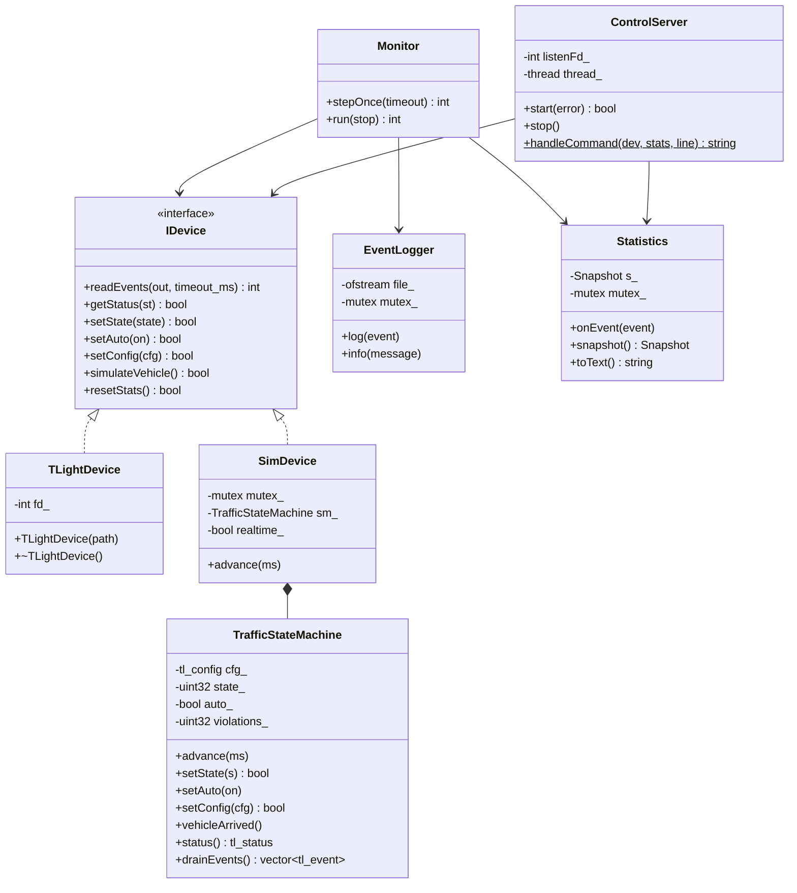

# UML – Class diagram

```mermaid
classDiagram
    class IDevice {
        <<interface>>
        +readEvents(out, timeout_ms) int
        +getStatus(st) bool
        +setState(state) bool
        +setAuto(on) bool
        +setConfig(cfg) bool
        +simulateVehicle() bool
        +resetStats() bool
    }
    class TLightDevice {
        -int fd_
        +TLightDevice(path)
        +~TLightDevice()
    }
    class SimDevice {
        -mutex mutex_
        -TrafficStateMachine sm_
        -bool realtime_
        +advance(ms)
    }
    class TrafficStateMachine {
        -tl_config cfg_
        -uint32 state_
        -bool auto_
        -uint32 violations_
        +advance(ms)
        +setState(s) bool
        +setAuto(on)
        +setConfig(cfg) bool
        +vehicleArrived()
        +status() tl_status
        +drainEvents() vector~tl_event~
    }
    class Monitor {
        +stepOnce(timeout) int
        +run(stop) int
    }
    class EventLogger {
        -ofstream file_
        -mutex mutex_
        +log(event)
        +info(message)
    }
    class Statistics {
        -Snapshot s_
        -mutex mutex_
        +onEvent(event)
        +snapshot() Snapshot
        +toText() string
    }
    class ControlServer {
        -int listenFd_
        -thread thread_
        +start(error) bool
        +stop()
        +handleCommand(dev, stats, line)$ string
    }
    IDevice <|.. TLightDevice
    IDevice <|.. SimDevice
    SimDevice *-- TrafficStateMachine
    Monitor --> IDevice
    Monitor --> EventLogger
    Monitor --> Statistics
    ControlServer --> IDevice
    ControlServer --> Statistics
```
