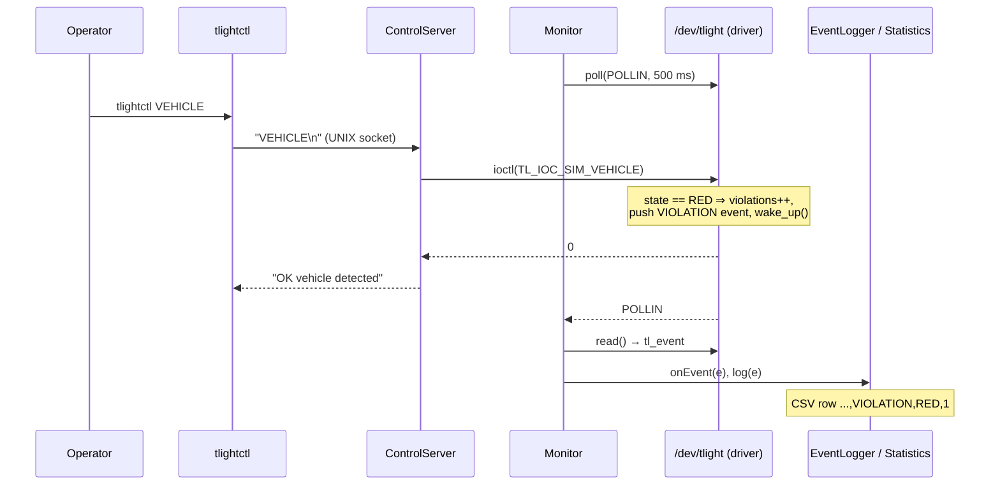

# UML – Sequence diagram: red-light violation

```mermaid
sequenceDiagram
    participant Op as Operator
    participant CLI as tlightctl
    participant CS as ControlServer
    participant Mon as Monitor
    participant Dev as /dev/tlight (driver)
    participant Log as EventLogger / Statistics

    Mon->>Dev: poll(POLLIN, 500 ms)
    Op->>CLI: tlightctl VEHICLE
    CLI->>CS: "VEHICLE\n" (UNIX socket)
    CS->>Dev: ioctl(TL_IOC_SIM_VEHICLE)
    Note over Dev: state == RED ⇒ violations++,<br/>push VIOLATION event, wake_up()
    Dev-->>CS: 0
    CS-->>CLI: "OK vehicle detected"
    Dev-->>Mon: POLLIN
    Mon->>Dev: read() → tl_event
    Mon->>Log: onEvent(e), log(e)
    Note over Log: CSV row ...,VIOLATION,RED,1
```
