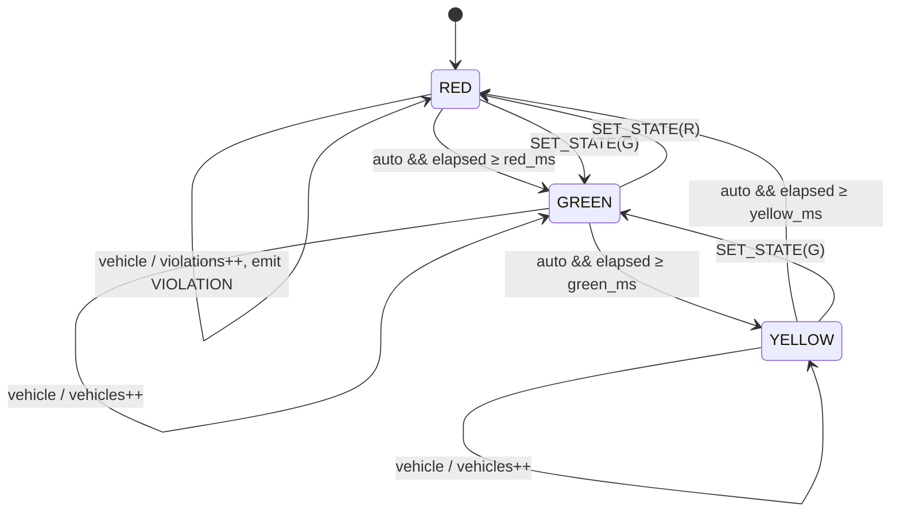

# UML – State machine diagram

Every transition that changes the colour emits a `STATE_CHANGE` event. `SET_STATE` is allowed
from any state to any state (shown partially for readability); when auto mode is on it restarts the
phase timer.
